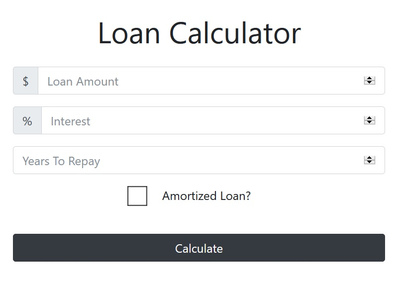

# LearningJS - Loan Calculator
> Simple application for planning loans where you can calculate simple interest or payment details for amortized loans built as a practice while learning JavaScript basics.

## Table of contents
* [General info](#general-info)
* [Screenshots](#screenshots)
* [Technologies](#technologies)
* [Live Demo](#live-demo)

## General info
In my learningJS series here on Git Hub I will showcase simple applications built mostly as a practice while learning JavaScript. Loan Calculator takes three parameters: loan amount, interest rate and years to repay. Based on choice about loan amortizaiton it will calculate monthly payment and totals for payment in general and interest. 

jQuery and Popper.js were loaded as Bootstrap dependencies.

## Screenshots

## Technologies
* Bootstrap - version 4.0.0
* Plain JS, CSS3, HTML5

## Live Demo
You can see live demo [here](https://codepen.io/dbilanoski/pen/KYPpEL).

